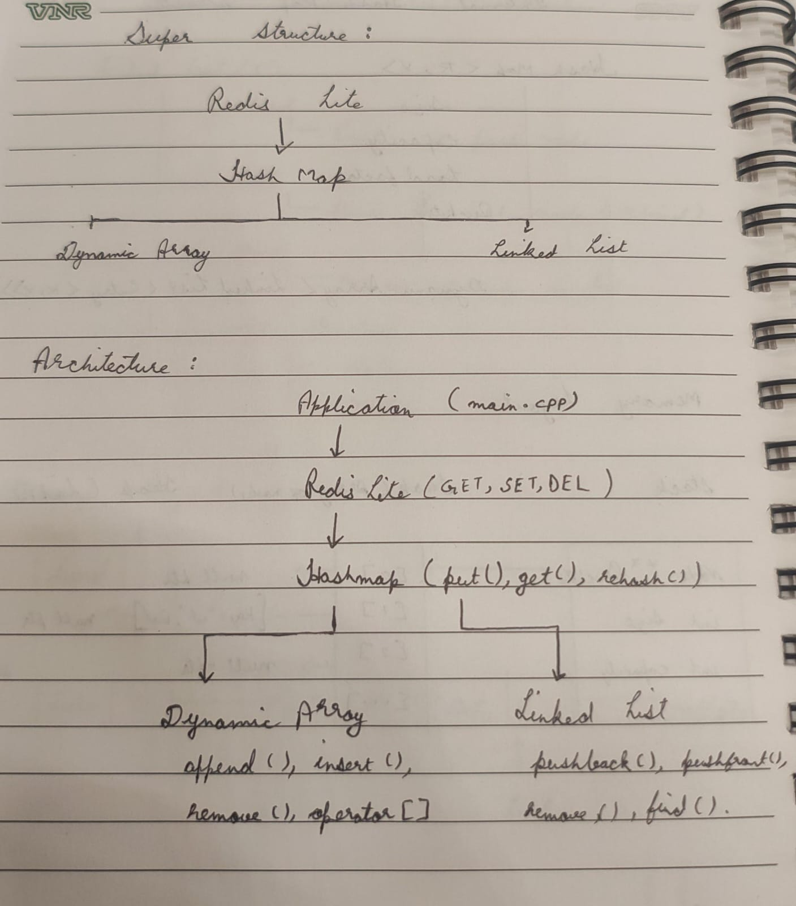
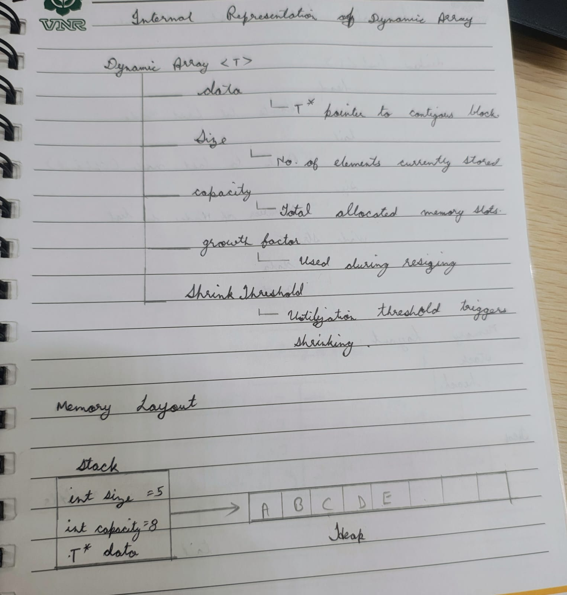
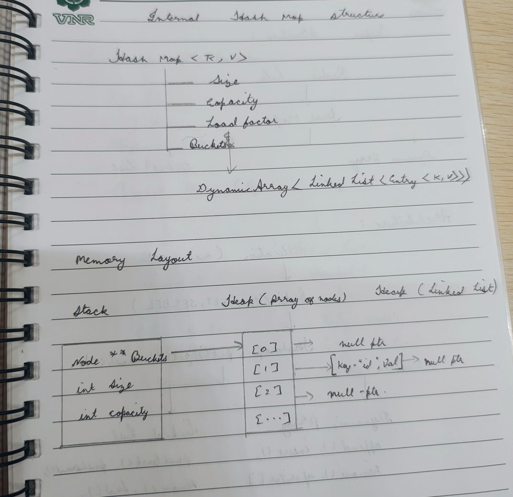

# Project 1 Design Proposal 

##  Project Objective:- 
This project is to create an implementation of three data structures in c++ without using the standard libraries.The data structures are:
Dynamic Array
Linked List 
Hash Maps
We will then implement this data structures in redis lite and further use them for the different projects.
The objective of this project is to understand how memory actually works in the syste

##  Section 1- Public API 
### DynamicArray<T>

Template Declaration

```template<typename T>```
```class DynamicArray```
```{...};```

I am using the template because it helps me in generic implementation and helps in porviding reusablity and makes file compact and strutured.Without the template we need to create different files for each datatype and therefore increases the complexity during deugging and minor changes.

**Public Methods** 
| Method | Parameters | Return Type | Purpose |
|----------|------------|-------------|---------|
| DynamicArray() | ```none``` | ```none``` | Initialize empty array |
| ~DynamicArray() | ```none``` | ```none``` | Release allocated memory |
| DynamicArray() | ```const DynamicArray<T>& other``` | ```none``` | Deep copy constructor |
| operator=() | ```const DynamicArray<T>& other``` | ```DynamicArray<T>&``` | Deep copy assignment |
| append() | ```const T& value``` | ```void``` | Add element at end |
| insert() | ```size_t index, const T& value``` | ```bool``` | Insert element at index |
| remove() | ```size_t index``` | ```bool``` | Remove element at index |
| pop_back() | ```none``` | ```bool``` | Remove last element |
| operator[] | ```size_t index``` | ```T&``` | Access element |


**Private helper Methods**
| Method | Parameters | Return Type | Purpose |
|----------|------------|-------------|---------|
| grow() | ```none``` | ```void``` | Double capacity when full |
| shrink() | ```none``` | ```void``` | Halve capacity when size falls below 25% utilization |

Justification: I selected operator[] instead of get() because it provides array-like syntax and constant-time access.

### LinkedList<T>

Template Declaration
```template<typename T>```
```class LinkedList```
```{...};```

| Method | Parameters | Return Type | Purpose |
|----------|------------|-------------|---------|
| LinkedList() | ```none``` | ```none``` | Initialize empty list |
| ~LinkedList() | ```none```| ```none``` | Release all nodes |
| LinkedList() | ```const LinkedList<T>& other ```| ```none``` | Deep copy constructor |
| operator=() | ```const LinkedList<T>& other``` | ```LinkedList<T>&``` | Deep copy assignment |
| insert() | ```size_t pos, const T& value``` | ```bool``` | Insert at specified position |
| remove() | ```const T& value``` | ```bool``` | Remove first matching element |
| find() | ```const T& value``` | ```int``` | Return position of element |

Justification: I selected value-based remove()instead of removeAt() because linked lists are commonly searched by value and do not provide efficient indexing.


### HashMap<Key, Value>

Template Declaration
```template<typename Key, typename Value>```
```class HashMap```
```{...};```

| Method | Parameters | Return Type | Purpose |
|----------|------------|-------------|---------|
| HashMap() | ```none``` | ```none``` | Initialize empty hash map |
| ~HashMap() | ```none``` | ```none``` | Release all allocated memory |
| HashMap() | ````const HashMap<Key, Value>& other``` | ```none``` | Deep copy constructor |
| operator=() | ```const HashMap<Key, Value>& other``` | ```HashMap<Key, Value>&``` | Deep copy assignment |
| get() | ```const K&``` | `V*` | Lookup value |
| put() | ```const Key& key, const Value& value``` | ```void``` | Insert or update key-value pair |
| remove() | ```const Key& key ```| ```bool``` | Remove key-value pair |
| contains() | ```const Key& key``` | ```bool``` | Check if key exists |


Justification: The hashmap api differs fron the list based containers because the structure stores key-value pairs instead of indexed data. The operations listed are therefore key oriented such as get,put,remove,contains instead of position oriented such as remove at,insert etc.

##### Error Handling Strategy

- Index out of bounds:
  insert(), remove() return bool.
  operator[] throws exception.

- Empty container:
  pop_back() returns false.

- Missing key:
  HashMap::get() returns nullptr.


### Section 2- Internal representation
#### Super Structure and Architecture

The Dynamic array and Linkedlist are two independent modules which can also be reused and can be updated as per the requirement without affecting the other dependent structures.

The Hashmap uses dynamic array to store the buckets and the linked list to store the nodes in case of collisions.

The Redis Lite uses hashmap for the operations because it takes O(1)lookups only.

**Dynamic Array**
Dynamic array is a contingous block of memory which grows by specific capacity whenever its loadfactor threshold gets triggered.  

 The dynamic array stores elements in single containers block of memory allocated on heap. THese allocations allows direct indexing and constant time access to any elements.

 **Linked List**
 It stores the elements inside the individual nodes which is allocated dynamically. Nodes are connected using the pointers which allows the list to grow without requiring a contigous memory.
 
 
 insertions and deletion operations are straight forward because the existing elements do not need to be shifted.

**HashMap**
The  hash map is a type of datastructure which uses an array of buckets where each bucket contains a linkedlist of key value pairs.

A hash function expression determines bucket index:
      hash=hash(key)%bucketcount


 When multiple keys are mapped to the same bucket they are stored in a corresponding chain.

 **Memory Ownership**
   - Each container owns its allocated memory.

   - Constructors allocate memory.
   - Destructors release memory.

   - Copy constructor and assignment operator perform deep copies.

   - This prevents memory leaks, dangling pointers and double free errors.
## Section 3- Complexity Analysis

  | Operation | Best|Average|Worst | Space | WHY|
  |------------|-----|-------|-------|-------|---|
  | DynamicArray get | O(1)|O(1)|O(1) | O(1) |Becuase index maps directly to the adress and no traversal is needed|
  | DynamicArray append | O(1)|O(1)*|O(n) | O(1) | Append is amortized O(1) because resizing occurs infrequently. Rehashing causes occasional O(n) operations but maintains constant average performance.|
  | DynamicArray insert | O(1)(append position)|O(n)|O(n) | O(1) | Inserting at any index needs to shift all the elements one postion next to them.|
  | DynamicArray shrink | O(n)|O(n)|O(n) |O(n/2) | halving capacity requires copying all n existing elements into the new smaller block|
  | LinkedList insert | O(1)|O(n)|O(n) | O(1) |insertion at the head position takes the O(1) further in all other cases it takes O(n)
  | LinkedList remove | O(1)|O(n)|O(n) | O(1) |removal at the head position takes the O(1) further in all other cases it takes O(n)
  | LinkedList find | O(1)|O(n)|O(n) | O(1) | bestcase occures when the element is at the head node.No random access is possible and we have to move from node by node until match or end.|
  | HashMap put | O(1)|O(1)|O(n) | O(1) |**
  | HashMap get | O(1)|O(1)|O(n) | O(1) |**
  | HashMap remove | O(1)|O(1)|O(n) | O(1) |**

**average case assumes a well-distributed hash spreading keys evenly across buckets; worst case occurs when many keys collide into the same bucket, degenerating that bucket's chain into a linked list traversal.

## Section 4- Design Decisions
In this given section l have selected some of the proposals and also listed the alternatives and reasons to reject them from my project.

### Decision 1- Dynamic Array Growth Stategy 
- Selected: Increase the growth capacity by 2x. Why? Doubling the capacity reduces the total number of reallocations to O(log n),
allowing append operations to achieve amortized O(1) complexity.
- Alternative: Growth by 1.5x, Growth by fixed no. of blocks. Why to reject? Because in 1.5x we will be having the fewer memory overhead but the reallocations will be more which will not let it optimize 
- Optimization Technique: Shrinking the capacity of the array. When the size of the array will be 25% of the capacity we will shrink the capacity by 50% which helps in efficient memory usage.

### Decision 2- Linked List Structure
- Selected: Singly Linked list: Why? I have selected this because it takes less memory. Insertion and deletion at the head are O(1). Operations at arbitrary positions require traversal and therefore take O(n).
- Alternative: Doubly Linked list: Why to reject? It takes almost 100% more memory head to store the previous pointers. 

### Decision 3- HashMap Collision Resolution Technique
- Selected: Seperate Chaining: Why? In this each bucket stores a seperate linked list which helps in better rehashing and also makes the performance constant under moderate collisions.
- Alternative: 1.Linear Probing: Why to reject? In this i creates a primary clusters in the table whichc reduces the performance as the table tends to get filled.
  2.Double Hashing: Why to reject? In this multiple hash functions increases the complexity in the implementation.
### Decision 4- Rehashing Strategy
- Selected: Rehashing to be done when the load factor >= 0.75 Why? It prevents the excessive collision chains.
- Alternative: Rehash at 50%- It wastes the memory but also provides good performance.
               Rehash at 100%- It increses the collisions occurence before the expansions happens.
### Decision 5- Copy Semantics
- Selected: Deep Copy: Why? the deep copy creates the copy of the given structure which recives it own memory allocations
- Alternative: Shallow Copy: It cannot be used because it creates a copy of the constructor but points to the same memory location whenever any changes will happen to the new constructuor it will be reflected to the original one also.
### Decision 6- Redis Lite Storage
- Selected: Hash map: why? it supports O(1) SET, GET,DEL operations and are easily scalable for the large datasets.
- Alternative: Dynamic Array: it takes O(n) for the same operations 
               Linked list: for all the lookups it needs traversal which agin takes O(n) time complexity.
### Decision 7- Hashfunction 
- Selected: Hash = Hash*31+key[i]: why? Because in various cases ASCII value for the strings remain same and it hashes two different strings to the same bucket.

## Summary
The proposed design sastisfies the project requirements and providing the foundation for the future enhancements. Many alternatives were not considered during the design process. The final choices majorly focuses on simplicity,maintainablity and performance. The functions such as Separate Chianing dynamic resizing and deep copy semantics hels in making the library reliable.